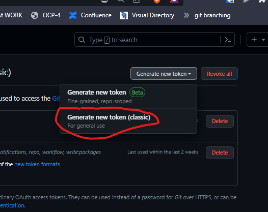
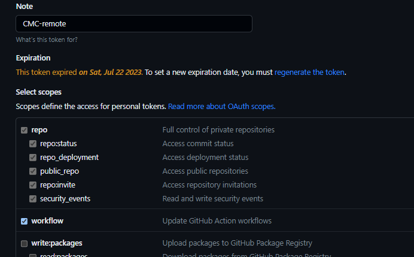

# Cycling the Access token

## Overview

The listener process monitors for available data.  When the data is available
it will trigger a github action that will:

1. download the data from the federal government hpfx server.
1. process the data into the t1.. t4... and p1.. p4 files.
1. upload the raw data and the processed data to object storage.

In order to triger the github action the listener process requires an api key.
Currently the only way to enable this functionality is with a personal access
token.  The personal access tokens are set to expire on a regular basis.  This
document describes the how to go about cycling that token so that the pipeline
continues to function correctly.

Unfortunately at the time of writing this, there is no way to auto cycle a
github personal access token.

# Cycling the token

Login to github and either create or find the personal access token.

## Creating new token

If you are creating a brand new token, follow these instructions.

Login to github and go to your profile settings:


* On the left hand menu find `developer settings`
* select [`Tokens (classic)`](https://github.com/settings/tokens)
* Then on the top of the screen click `Generate Token`

* Then select repo level permissions and github actions permissions

* On the following screen copy the token and save it somewhere temporarily as
  it will get copied to a different location in the upcomming step (Copy Token to Repository)


## Cycle the token

The steps here are very similar to those for generating a new token, only you
select the token that you want to regenerate and regenerate it.

steps:

* go to  [`Tokens (classic)`](https://github.com/settings/tokens)
* Select the token that you want to regenerate
* Select the option `regenerate`
* Copy the token and save it somewhere temporarily as it will be used in the
  next step.


## Update Token in CMC Repo

* go to the the [CMC copy repository, ie this one!!](https://github.com/bcgov/nr-rfc-grib-copy)
* go to the [repo settings->Environments](https://github.com/bcgov/nr-rfc-grib-copy/settings/environments)
* select the `prod` environment
* select the edit icon for the token 'CMC_TOKEN'


* and paste the token that was created in either the `Creating new token` or the `Cycle the token` steps.

## Copy to openshift - CLI

* login to openshift
* run the following command where TOKEN env var is set to the new token

```
TOKEN=<token goes here>
oc patch secret messagesubscriber-prod-listener-ghs  \
--patch="{\"data\": {\"gh-access-token\": \"$(base64 <<< $TOKEN)\",  \"gh-org\": \"$(base64 <<< bcgov)\", \"gh-repo\": \"$(base64 <<< nr-rfc-grib-copy)\"}}"
```